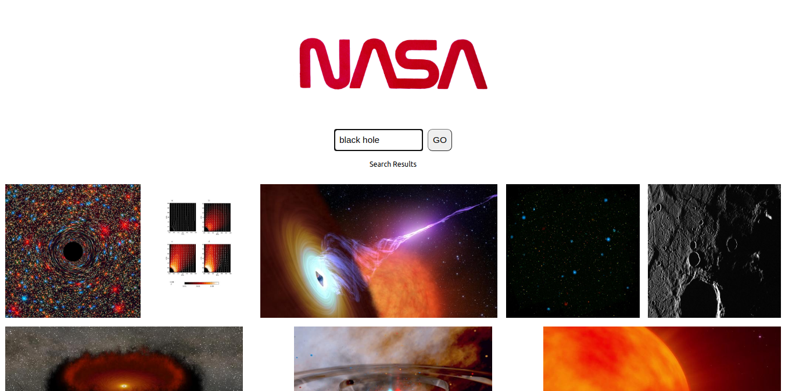
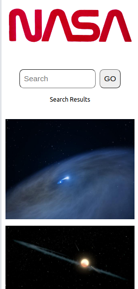

# Tech Test: NASA Image Search App

## The Brief

Build a React web application that allows users to search for images based on a query relating to space. You are provided the NASA API endpoint for image search.\
\
The following functionalities need to be implemented:
* A Search page which allows users to search for images by keyword
* Images must be returned upon a successful search

### Browser view:

### Mobile view:

## API endpoint:

GET​​ ​​[https://images-api.nasa.gov/search?q=query](https://images-api.nasa.gov/search?q=query)

## Build

This app was built with React using [`create-react-app`](https://github.com/facebook/create-react-app).

## Testing Utilities

Jest, React Testing Library

## Packages

Axios, PropTypes

# Run the App

The app is deployed live on GitHub Pages at https://samtovey13.github.io/NASA-image-search/ .\
\
Alternatively, to run the app locally on your machine, clone the repo and use the following from the command line inside the project directory:

### `npm start`

Runs the app in the development mode and opens [http://localhost:3000](http://localhost:3000) to view it in the browser.

The page will reload if you make edits and you will also see any lint errors in the console.

### `npm test`

Launches the test runner in the interactive watch mode.
See [docs](https://facebook.github.io/create-react-app/docs/running-tests) for more information.

# Additional Notes

## Areas for development

If I had more time I would add a checkbox for 'images' and 'videos' below the search input, and filter the API results based on content type.\
\
I would improve the search input component with autocomplete suggestions of space-themed words.\
\
I would improve the formatting of the image gallery so that it responds more effectively to the mixed dimensions of the returned images.

## Author
Samantha Tovey 
https://twitter.com/SamTovey13